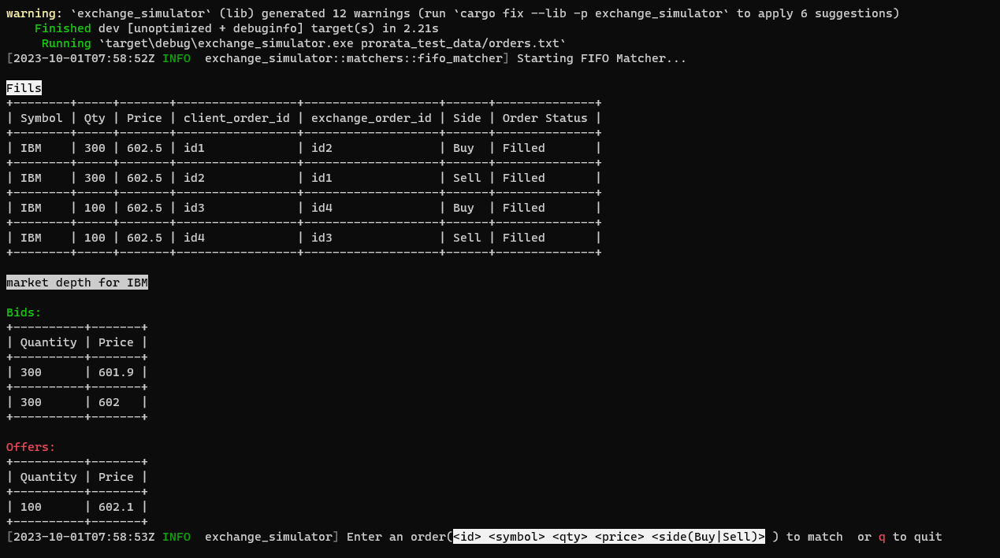

A simple exchange simulator project with the following features

* Accept an order
* Accept orders from a file
* match an order using FIFO matcher or Pro-rata
  matcher (https://corporatefinanceinstitute.com/resources/career-map/sell-side/capital-markets/matching-orders/)

The module sim is the back end exchange simulator that has all the matching functionalities with a CLI. The web module
adds the web support.Either project can be compiled by renaming the main.rs file of the module appropriately.
For example, i name the sim main file as <i>main.rs.cli</i> when buidling the project to run the web module.By default the web module is built and run 

<H2> CLI Modile </H2>

<h3>Usage:</h3>

execute cargo run -- -h or  

exchange_simulator -h for complete usage help

Examples:

For the order file below

id1 IBM 300 602.5 Buy 
id2 IBM 300 602.5 Sell 
id3 IBM 100 602.5 Buy 
id4 IBM 100 602.5 Sell 
id5 IBM 300 602 Buy 
id6 IBM 300 601.9 Buy 
id4 IBM 100 602.1 Sell 

executing <i> cargo run -- prorata_test_data/orders.txt</i> will produce the following output 

 

if we executed the command using ProrataMatcher as such

executing <i> cargo run -- prorata_test_data/orders.txt PRO </i> will produce the following output 

 

Executing just cargo run (or exchange_simulator without any arguments) will start the FIFO matcher with an empty order
book that the user may populate from command line

<h2>Web Module</h2>

By default the FIFO algo us used for matching. Set the ALGO environment variable to select the 
algo for the matcher like so

export ALGO=PRO

<h3> Usage: </h3>

cargo run or web.exe(from target/debug or target/release directory). This starts a web server locally 
on port 8000. The following urls are supported

* /index.html : the order entry page
* /order_entry : Submits the order for matching. Responds with fills if matched. Returns the fills in either json or 
   html format
* /order_book/json : 
  * Displays the current order book in json format
* /order_book/pretty: 
  * Displays the current order book as html table
* /reset      : resets the order book to an empty order book.  Reset is enabled only for admin roles.
* /file_upload.html     : Upload an order file to create the order book. Multiple uploads will update the order book

A single order book is shared by all users . Order Book is persisted and survives server restart. Access to order book is thread safe

All responses are in json by default. HTML output is rendered if the pretty format is chosen

At some point i would like to add FIX support. There is nothing available in https://crates.io/ that is stable enough for use. 
Looks like this has to be built ground up. 

[//]: # (TODO)

