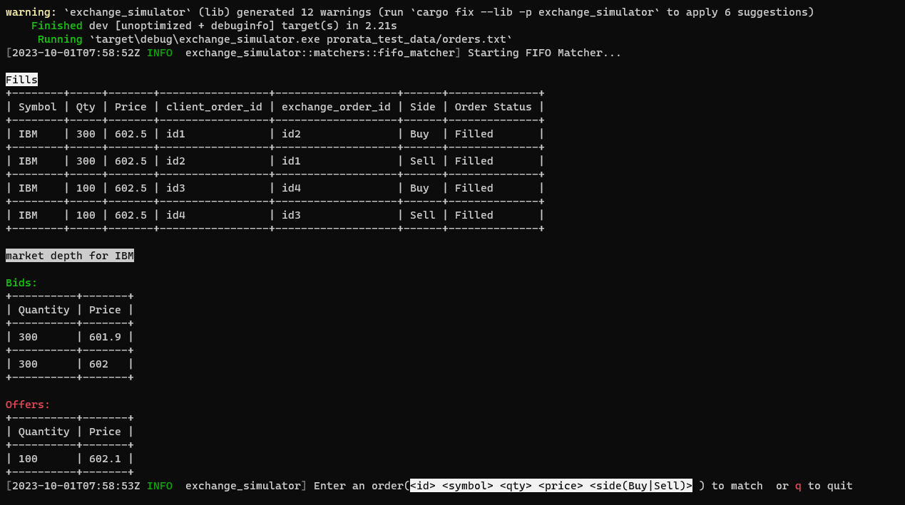

A simple matching engine that simulates an exchange with the following features

* Accept an order
* Accept orders from a file
* match an order using FIFO matcher or Pro-rata
  matcher (https://corporatefinanceinstitute.com/resources/career-map/sell-side/capital-markets/matching-orders/)

<H2>Matching Engine </H2>

<h3>Usage:</h3>

execute cargo run -- -h or  

matching_engine -h for complete usage help

Examples:

For the order file below

id1 IBM 300 602.5 Buy 
id2 IBM 300 602.5 Sell 
id3 IBM 100 602.5 Buy 
id4 IBM 100 602.5 Sell 
id5 IBM 300 602 Buy 
id6 IBM 300 601.9 Buy 
id4 IBM 100 602.1 Sell 

executing <i> cargo run -- prorata_test_data/orders.txt</i> will produce the following output 

 

if we executed the command using ProrataMatcher as such

executing <i> cargo run -- prorata_test_data/orders.txt PRO </i> will produce the following output 

 

Executing just cargo run (or sim without any arguments) will start the FIFO matcher with an empty order
book that the user may populate from command line

<h3>API docs:</h3>
All public apis are extensively documented. Please refer to them for help on actual usage